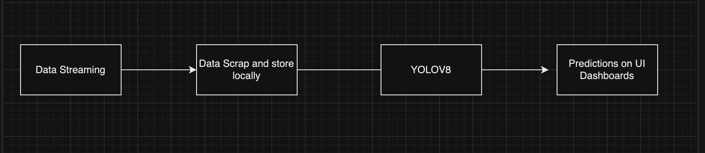

# Traffic Monitoring Web Application

## Overview

This Traffic Monitoring Web Application is designed to scrape live traffic data from public URLs, predict vehicle counts using the YOLOv8 object detection model, and dynamically update traffic information on an interactive map. The application provides real-time insights into traffic congestion across various locations, displayed on a clean and user-friendly web interface.

## Features

- **Real-time Traffic Data**: Scrapes images from public traffic cameras.
- **Object Detection**: Uses the YOLOv8 model to detect vehicles and classify them.
- **Dynamic UI Updates**: Displays live vehicle counts from different camera locations on a map.
- **Storage & Logging**: Traffic data and prediction results are logged and updated periodically.

## Approach

1. **Data Scraping**: We scrape traffic images from live URLs, capturing real-time data from different traffic locations.
2. **Local Storage**: The images are stored locally for further processing.
3. **Object Detection using YOLOv8**: Each image is passed through the YOLOv8 model to detect and classify vehicles (cars, buses, trucks, etc.).
4. **Data Logging**: The results of vehicle counts are logged and stored periodically.
5. **UI Update**: The web interface is updated with the current vehicle counts for each location, providing a visual representation of traffic conditions on the map.

## Flowchart
Below is the flowchart outlining the approach we took for the project:


## Tech Stack

- **FastAPI**: Backend API framework for handling requests and serving data.
- **YOLOv8**: Pre-trained object detection model for predicting vehicle types.
- **JavaScript, HTML, CSS**: Frontend technologies for interactive UI.
- **Python**: Main programming language for backend and processing.
- **Docker**: Containerization for easy deployment.

## Setup and Installation

### Prerequisites

Ensure you have the following installed:

- **Python 3.8+**
- **Docker** (if you prefer running the app in a container)
- **FastAPI** and **Uvicorn** for backend API
- **YOLOv8 Pre-trained Model** (install via `ultralytics` package)
  
### Local Installation

1. **Clone the Repository**

   ```bash
   git clone https://github.com/your-repo/traffic-monitoring-app.git
   cd traffic-monitoring-app

2. **Install Dependencies**
   Install the required Python libraries via pip:
   ```bash 
   pip install -r requirements.txt

3. **Download YOLOv8 Model**
   Install the `ultralytics` package and download the pre-trained YOLOv8 model:
   ```bash
   pip install ultralytics

4. **Run the FastAPI Backend**
   Start the FastAPI server with Uvicorn:
   ```bash
   uvicorn app.main:app --reload
   The API will be running locally at `http://127.0.0.1:8000`. 

5. **Scrape Data and Start Predictions**
    Data scraping, processing, and prediction will run automatically. Results will be displayed on the map as per the configured locations.

### Docker Setup 

    For running the app using Docker, follow these steps:

1. **Build the Docker Image**
   ```bash
   docker build -t traffic-monitoring-app .

2. **Run the Docker Container**
   docker run -p 8000:8000 traffic-monitoring-app

   The app will be available at `http://localhost:8000`.


### Usage

1. Open the app in your browser and click on the location buttons on the map to view traffic statistics.
2. The backend automatically processes images scraped from the camera URLs and provides live predictions for each location.
3. Results are updated in real-time, showing the current number of vehicles detected at each location.

### Folder Structure

```plaintext
traffic-monitoring-app/
├── static/
│   ├── styles.css              # Stylesheet for frontend
│   ├── script.js               # JavaScript for frontend logic
│   ├── map.jpg                 # Map image for UI
│   └── index.html              # HTML file for frontend
│
├── Dockerfile                  # Dockerfile for containerization
├── requirements.txt            # Python dependencies
├── README.md                   # Project documentation
├── .gitignore                  # Ignored files
├── main.py                     # FastAPI backend
├── scraper.py                  # Scraping utility
└── yolov8_processing.py        # YOLOv8 object detection
